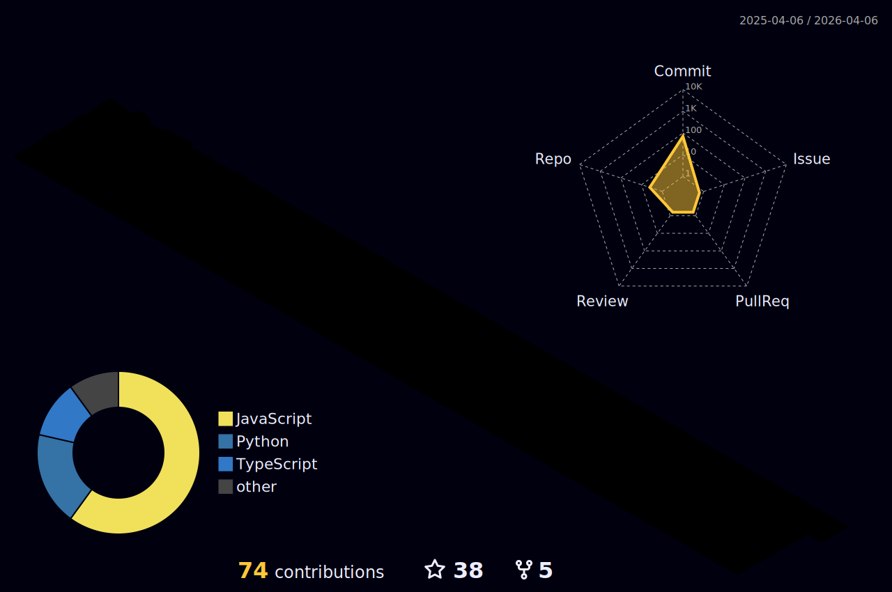

# cx330o — Real-time mmWave Radar Sensing

**mmWave · IWR6843 · DCA1000 · Real-time DSP · Indoor Tracking · Stepwise Fall Detection**

---

## 🎯 About Me

###   English
Hi 👋 I build **real-time mmWave radar systems** for indoor sensing — from **raw ADC capture** to **DSP**, **tracking**, and **activity / fall understanding**.

My current work focuses on:
- **Multi-representation radar features**: range–time / range–Doppler / micro-Doppler / point cloud  
- **Robust real-time tracking**: stable trajectories under clutter, occlusion, and multi-target scenes  
- **Stepwise fall detection**: modeling *phases* (pre-fall → descent → impact → post-fall) instead of only “fall / no-fall”

**Research keywords:** mmWave Radar · IWR6843 · DCA1000 · Real-time DSP · Indoor Tracking · Micro-Doppler · Point Cloud · Sensor Fusion · Fall Detection

---

###   日本語
こんにちは 👋 屋内環境における **mmWave レーダのリアルタイムセンシング**を研究・開発しています。  
**Raw ADC 取得 → DSP 信号処理 → Tracking → 行動/転倒理解**までを一気通貫で実装し、安定して動くリアルタイムパイプラインを作ることを重視しています。

現在の重点テーマ：
- **複数表現の活用**：range–time / range–Doppler / micro-Doppler / point cloud  
- **鲁棒なリアルタイム追跡**：クラッタ・遮蔽・複数人物でも軌跡を安定化  
- **段階的転倒検出**：pre-fall → descent → impact → post-fall の *フェーズ* を理解（単純な二値分類ではない）

**キーワード：** mmWave Radar · IWR6843 · DCA1000 · Real-time DSP · Indoor Tracking · Micro-Doppler · Point Cloud · Sensor Fusion · Fall Detection

---

## 🧷 Keywords & Project Links

- **mmWave / IWR6843 / DCA1000**
  - TI IWR6843 + DCA1000 **raw ADC acquisition + real-time processing**
- **Real-time Radar Pipeline**
  - End-to-end streaming: capture → DSP → visualization → tracking → recognition
- **Fall Detection**
  - Phase-aware (stepwise) fall understanding for indoor safety

🔗 **Pinned / related repos**:  
- `mmWave real-time pipeline`
- `IWR6843 + DCA1000 capture & DSP`
- `Fall detection / micro-Doppler experiments` 

---

## 📊 GitHub Overview (auto-generated)

<!-- Main metrics (generated by workflow: metrics.yml) -->

<table style="width:100%; border-collapse:collapse; border:none; border-spacing:0;">
  <tr>
    <td style="padding:0; border:none; vertical-align:top; width:50%;">
      
    </td>
    <td style="padding:0; border:none; vertical-align:top; width:50%;">
      
    </td>
  </tr>
  <tr>
    <td style="padding:0; border:none; vertical-align:top; width:50%;">
      
    </td>
    <td style="padding:0; border:none; vertical-align:top; width:50%;">
      
    </td>
  </tr>
</table>

---

## 🧊 3D Contribution

<!-- Generated by workflow: profile-3d.yml -->

---

### ✨ Signal in. Noise out.

**EN** — *I know nothing for certain — but the stars still make me dream.*  
**JP** — *確かなことは何も分からない。けれど星空は、今も夢を見させてくれる。*

