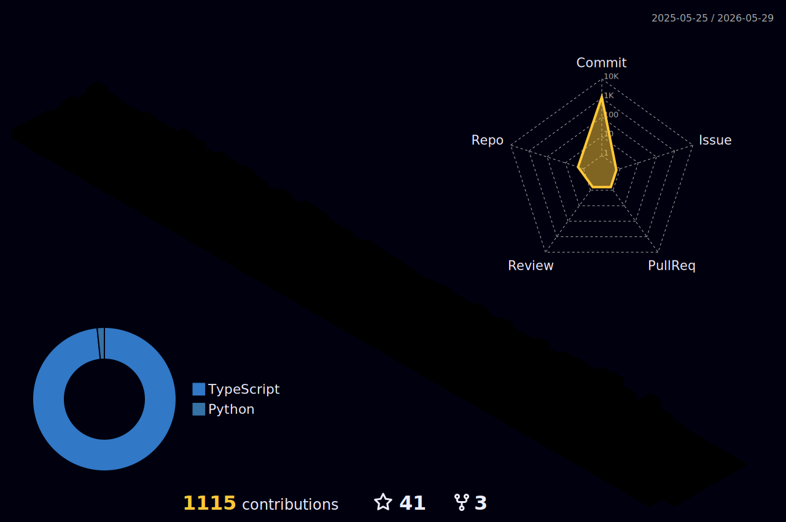

  <!-- Dynamic Emojis -->
  

    
    
    
    
    
  

  <h1>Welcome to cx330o's GitHub</h1>

  <!-- TYPING:START -->
  <!-- TYPING:END -->

  
&nbsp;

---

## 🔑 Keywords

<!-- KEYWORDS:START -->
              

<!-- KEYWORDS:END -->

---

## 🧰 Tech Stack

<!-- TECHSTACK:START -->

<!-- TECHSTACK:END -->

---

## 📂 Active Projects

<!-- PROJECTS:START -->
| Project | Description | Language | Stars | Updated |
|---------|-------------|----------|-------|---------|
| 🔷 [cx330o-overseas-sales](https://github.com/cx330o/cx330o-overseas-sales) | 海外営業プラットフォーム — AI リード生成・自動アウトリーチ・CRM・マーケティング統合基盤 | TypeScript | ⭐ 4 | today |
| 🔷 [cx330o-fastsend](https://github.com/cx330o/cx330o-fastsend) | A lightweight, self-hosted web clipboard for sharing text and files across de... | TypeScript | ⭐ 3 | yesterday |
| 🔷 [cx330o-agent](https://github.com/cx330o/cx330o-agent) | Full-stack AI agent platform with multi-turn tool calling, real-time streamin... | TypeScript | ⭐ 4 | yesterday |
| 🔷 [cx330o-hosei](https://github.com/cx330o/cx330o-hosei) | 法政大学3キャンパス統合プラットフォーム - 電車・バス時刻表 + 学生SNS + AIチャットボット \| React 19 + Flask + Groq... | TypeScript | ⭐ 3 | 2 days ago |
| 🐍 [cx330o-radar](https://github.com/cx330o/cx330o-radar) | リアルタイムミリ波レーダーデータ取得・可視化システム | Python | ⭐ 31 | 2 months ago |

<!-- PROJECTS:END -->

---

## 📊 GitHub Overview

<!-- Main metrics (generated by workflow: metrics.yml) -->

<table style="width:100%; border-collapse:collapse; border:none; border-spacing:0;">
  <tr>
    <td style="padding:0; border:none; vertical-align:top; width:50%;">
      
    </td>
    <td style="padding:0; border:none; vertical-align:top; width:50%;">
      
    </td>
  </tr>
  <tr>
    <td style="padding:0; border:none; vertical-align:top; width:50%;">
      
    </td>
    <td style="padding:0; border:none; vertical-align:top; width:50%;">
      
    </td>
  </tr>
</table>

---

## ⚡ Recent Activity

<!-- ACTIVITY:START -->
- 🆕 Created branch `main` in [cx330o/cx330o-overseas-sales](https://github.com/cx330o/cx330o-overseas-sales)
- 🆕 Created branch `main` in [cx330o/cx330o-agent](https://github.com/cx330o/cx330o-agent)
- ⭐ Starred [ultraworkers/claw-code](https://github.com/ultraworkers/claw-code)

<!-- ACTIVITY:END -->

---

## 📈 Activity Graph

<!-- Activity Graph (auto switch by theme) -->
<table>
  <tr>
    <td>
      <picture>
        <source media="(prefers-color-scheme: dark)"  srcset="https://github-readme-activity-graph.vercel.app/graph?username=cx330o&theme=tokyo-night" />
        <source media="(prefers-color-scheme: light)" srcset="https://github-readme-activity-graph.vercel.app/graph?username=cx330o&theme=xcode" />
        
      </picture>
    </td>
  </tr>
</table>

---

## 🐍 Snake Eating Contributions

<picture>
  <source media="(prefers-color-scheme: dark)" srcset="https://github.com/cx330o/cx330o/blob/output/github-snake-dark.svg" />
  <source media="(prefers-color-scheme: light)" srcset="https://github.com/cx330o/cx330o/blob/output/github-snake.svg" />
  
</picture>

---

## 🧊 3D Contribution

<!-- Generated by workflow: profile-3d.yml -->

---

<!-- QUOTE:START -->

<!-- QUOTE:END -->

